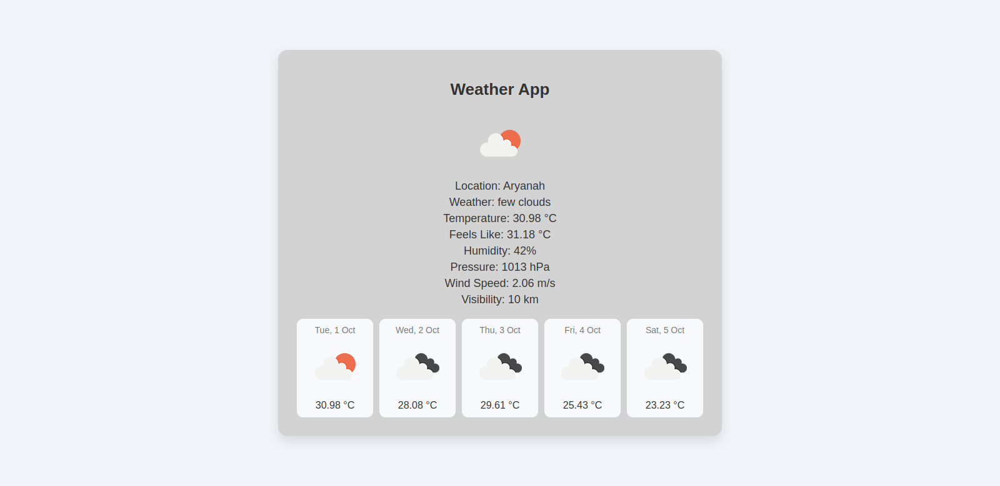

# Weather App
A simple weather application that fetches weather data based on the user's location using the OpenWeatherMap API and the Geolocation API. The app provides current weather details and a 5-day forecast with an improved and modern interface.

## Features
- Fetches weather data using OpenWeatherMap API
- Uses geolocation to get current weather based on user's location
- Displays current weather details such as:
  - Location
  - Temperature
  - Weather condition
  - Humidity
  - Wind speed
  - Pressure
  - Feels like temperature
  - Visibility
- 5-day weather forecast with date and temperatures
- Responsive and modern design

## Technologies Used
- HTML5
- CSS3
- JavaScript (ES6+)
- OpenWeatherMap API
- Geolocation API

## Getting Started

### Prerequisites
- A web browser
- OpenWeatherMap API key (you can get one by signing up at [OpenWeatherMap](https://home.openweathermap.org/users/sign_up))

### Installation
1. Clone the repository:
    ```bash
    git clone https://github.com/your-username/weather-app.git
    ```

2. Navigate to the project directory:
    ```bash
    cd weather-app
    ```

3. Open the project in your preferred code editor.

4. In `app.js`, replace `YOUR_API_KEY_HERE` with your actual OpenWeatherMap API key.
    ```javascript
    const apiKey = "YOUR_API_KEY_HERE";
    ```

5. Open the `index.html` file in your browser to see the app in action.

### Usage
- The app automatically fetches the weather data for your current location when loaded.
- It displays weather data such as temperature, weather condition, humidity, wind speed, etc.
- The app also shows a 5-day weather forecast with temperatures for each day.

## Project Structure
``` bash
weather-app/
├── index.html
├── style.css
└── app.js
```

### Example Output
- **Current Weather:** Displays current location, temperature, weather condition, wind speed, etc.
- **5-Day Forecast:** Displays the weather forecast for the next 5 days.

### Screenshots

  <!-- Optional: Add screenshots here to showcase the app interface -->

## API Reference

### OpenWeatherMap API
- To use the OpenWeatherMap API, you need an API key. You can sign up and get your API key [here](https://home.openweathermap.org/users/sign_up).
- API URL format used in the app:

    ```bash
    https://api.openweathermap.org/data/2.5/weather?lat={latitude}&lon={longitude}&appid={API_KEY}&units=metric
    ```

## Enhancements
- **UI/UX Improvements:** The interface has been modernized with a card-based design and improved layout.
- **Additional Features:**
  - Display more information such as pressure, visibility, and wind speed.
  - A neat 5-day forecast section is added, styled in a grid layout.

## Future Improvements
- Add a search feature for users to look up weather data by city name.
- Implement temperature unit conversion between Celsius and Fahrenheit.
- Include more detailed weather data, such as UV index, sunrise, and sunset times.

## License
This project is licensed under the MIT License - see the [LICENSE](LICENSE) file for details.

